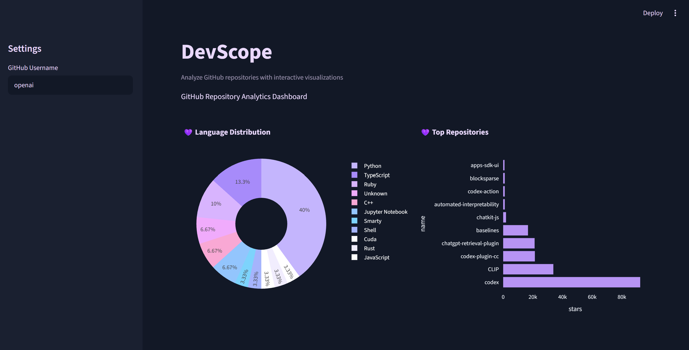
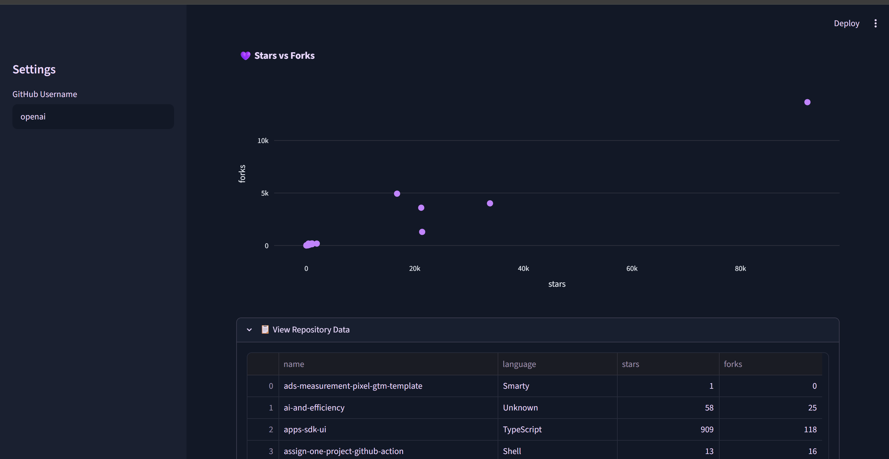

#  DevScope

DevScope is an interactive GitHub analytics dashboard built using Streamlit, Plotly, Pandas, and the GitHub REST API.

The application allows users to analyze any public GitHub profile and visualize repository statistics through an interactive dashboard.

---

## Features

- Analyze any public GitHub account
- Interactive dashboard interface
- Repository statistics
- Language distribution analysis
- Top repositories by stars
- Stars vs forks correlation analysis
- Expandable repository data table
- Responsive Streamlit interface

---

## Dashboard Preview




---

## Technologies Used

- Python
- Streamlit
- Pandas
- Plotly
- Requests
- GitHub REST API

---

## Installation

```bash
git clone https://github.com/Atheer554/DevScope.git

cd DevScope

pip install -r requirements.txt

streamlit run app.py
